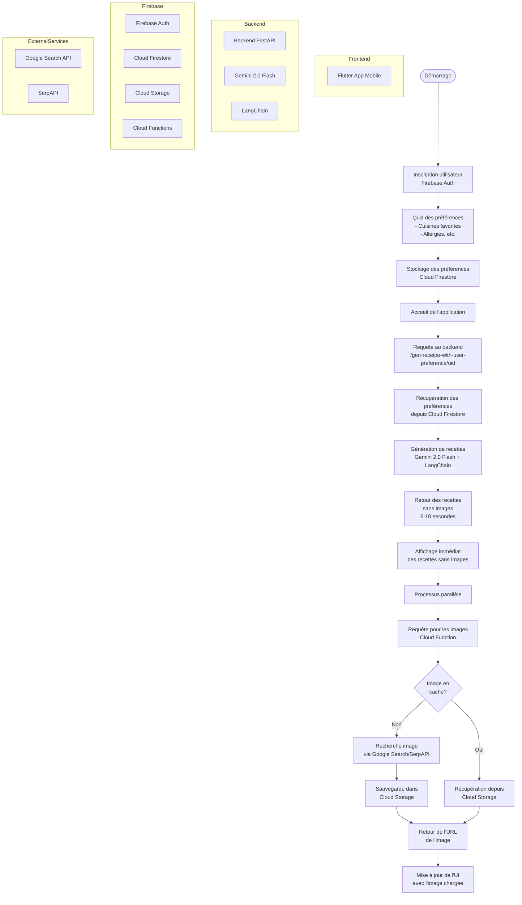

# Eat'Easy

A new Flutter project.

## Getting Started

## Architectures

```mermaid
flowchart TD
    %% Inscription et collecte des préférences
    Start([Démarrage]) --> UserSignup[Inscription utilisateur\nFirebase Auth]
    UserSignup --> Quiz[Quiz des préférences\n- Cuisines favorites\n- Allergies, etc.]
    Quiz --> SavePrefs[Stockage des préférences\nCloud Firestore]
    SavePrefs --> Home[Accueil de l'application]
    
    %% Génération de recettes
    Home --> RequestRecipes[Requête au backend\n/gen-receipe-with-user-preference/uid]
    RequestRecipes --> GetUserPrefs[Récupération des préférences\ndepuis Cloud Firestore]
    GetUserPrefs --> GenerateRecipes[Génération de recettes\nGemini 2.0 Flash + LangChain]
    GenerateRecipes --> ReturnRecipes[Retour des recettes\nsans images\n6-10 secondes]
    
    %% Affichage des recettes et chargement parallèle des images
    ReturnRecipes --> DisplayRecipesNoImages[Affichage immédiat\ndes recettes sans images]
    
    DisplayRecipesNoImages --> ParallelProcess[Processus parallèle]
    
    ParallelProcess --> FetchImages[Requête pour les images\nCloud Function]
    FetchImages --> CheckCache{Image en\ncache?}
    
    %% Gestion du cache d'images
    CheckCache -->|Oui| GetFromStorage[Récupération depuis\nCloud Storage]
    CheckCache -->|Non| SearchImage[Recherche image\nvia Google Search/SerpAPI]
    SearchImage --> SaveToStorage[Sauvegarde dans\nCloud Storage]
    SaveToStorage --> ReturnImageURL[Retour de l'URL\nde l'image]
    GetFromStorage --> ReturnImageURL
    
    ReturnImageURL --> UpdateUIWithImage[Mise à jour de l'UI\navec l'image chargée]
    
    %% Technologies utilisées
    subgraph Frontend
        Flutter[Flutter App Mobile]
    end
    
    subgraph Backend
        FastAPI[Backend FastAPI]
        LLM[Gemini 2.0 Flash]
        LC[LangChain]
    end
    
    subgraph Firebase
        Auth[Firebase Auth]
        Firestore[Cloud Firestore]
        Storage[Cloud Storage]
        CloudFunc[Cloud Functions]
    end
    
    subgraph ExternalServices
        GoogleSearch[Google Search API]
        SerpAPI[SerpAPI]
    end
```