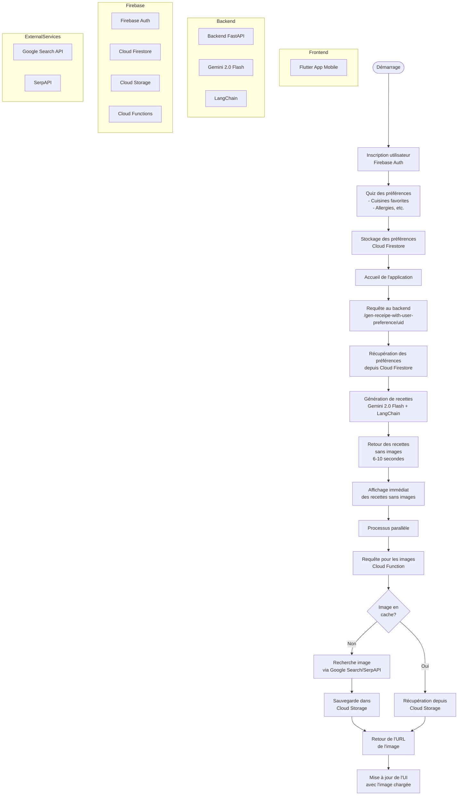

# Eat'Easy

A new Flutter project.

## Getting Started


## Architectures

### Suggestion de recette sur la page principale


### Recettes cuisinées & favoris (Cloud Firestore)

```
UserFinishedRecipes/{uid}
├── recipes/{autoId}          → historique des recettes marquées comme cuisinées
│                                (champs : recipeId, note, finishedAt)
└── FavoriteRecipes/{recipeId} → recettes ajoutées en favoris
                                 (doc = JSON complet de UserRecipeV2, id du doc = id de la recette)
```

⚠️ Le nom de la collection racine `UserFinishedRecipes` est trompeur : elle contient
aussi bien l'historique des recettes cuisinées (`recipes`) que les favoris
(`FavoriteRecipes`), pas uniquement les recettes "finies".

Voir `lib/receipe/infrastructure/receipe_repository_v2.dart` (`markRecipeAsFinished`,
`recipeCookedSummary`, `addToFavorite`).